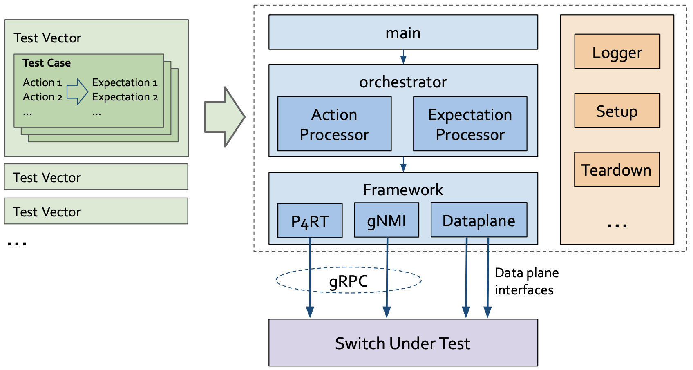

# Test Vectors Runner Architecture

Test Vector Runner reads from one or multiple Test Vector files (for more information about Test Vectors please check the [Test Vector repo](https://github.com/opennetworkinglab/testvectors)) and compiles them with an orchestrator by processing various types of actions and expectations. And eventually based on the action or expectation type, the orchestrator calls different framework modules to build and send or receive either gRPC messages or data plane packets. We also provide libraries which provides common functions for logging, gRPC connection establishment and packet IO.
