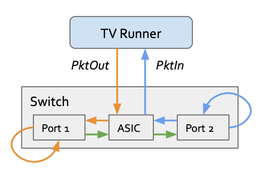

# Loopback Mode

We use the diagram above to demonstrate how testvectors-runner emulates ingress/egress data plane packets without physically connecting cables to the hardware switch ports when loopback mode is enabled on the switch.

Assuming loopback is enabled on both port 1 and port 2 on the switch, to emulate an ingress packet to port 1 and an egress packet from port 2, testvectors-runner simply sends a packet-out to port 1 which loops back to the same port (orange arrows) and the get processed  by the pipeline as a normal ingress packet from port 1 (green arrows). When the packet egresses from port 2 again it loops back to the same port. In order to "capture" the egress packet, a specific ACL rule needs to be installed on port 2 which matches all loopback packets on that port and send to CPU. In this way testvectors-runner receives the packet as a packet-in (blue arrows).

> Note: Since extra ACL rules need to be installed on "egress" ports in order to "capture" the packets, it is not supported in loopback mode to use the same port as both ingress and egress to the switch. And it is required to mark ports used in the test as either ingress or egress in the portmap file. Please see [Test Vectors repo](https://github.com/opennetworkinglab/testvectors) for more details.

With loopback mode working, testvectors-runner is able to support TrafficStimulus and TrafficExpectations defined in Test Vectors by translating them to packet-in and packet-out processings. The translating is transparent to users and the same set of Test Vectors could be used in both loopback mode and non-loopback mode.
